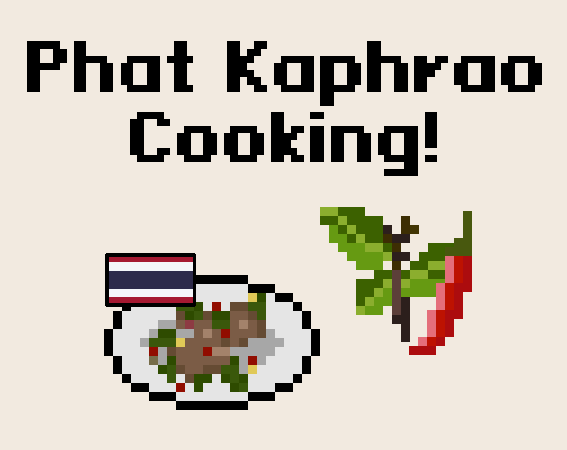

# Phat Kaphrao Cooking Game

Fast-paced Thai street cooking game built with **Bevy Engine** 🦀.

Drop ingredients.
Hit the timing gauge.
Don't burn the pan.

Every action is event-driven and synchronized through Bevy ECS — from ingredient drops to animation switching and cooking state progression.

## 📺 Demo Video

[Youtube](https://www.youtube.com/watch?v=KdyGovts-y8)

## ⚙️ Tech Stack

* Rust
* Bevy Engine
* Aseprite
* FL Studio

## 🎮 Core Idea

Cooking isn't relaxing.
It's pressure, timing, and chaos.

Built for **Bevy Game Jam**.

# 🎮 How to Play

- Drag and drop an ingradients into a pan.
- Right is egg's pan, Left is Kaphrao's pan.
- Press space when it's hit the gauage.
- PS. You can see the step at left side.

---

Copyright 2026
Ruangyot Nanchiang
Kachon Wanglavan
**[Phat Kaphrao Cooking Project]**
